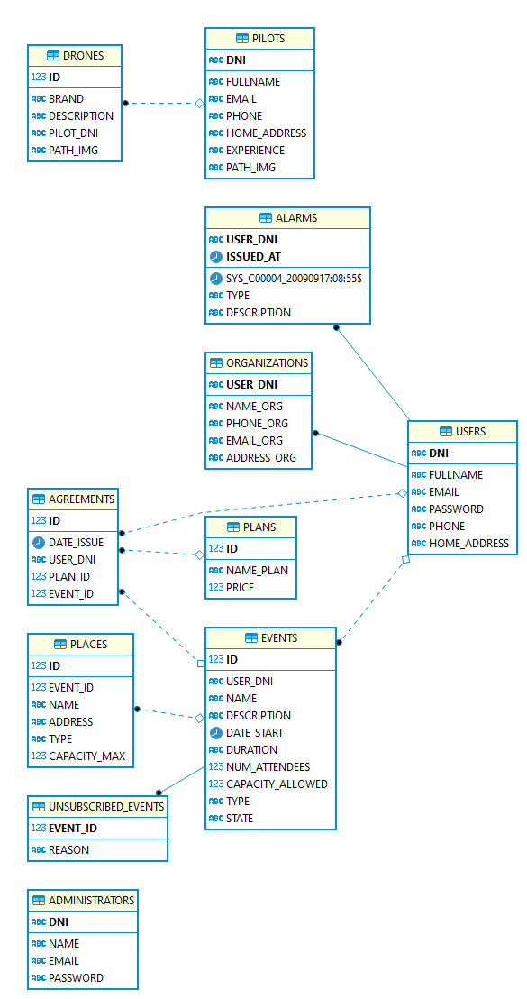

# DroneSolution

A project of DB Course at UG 👨‍🎓


## Description

A web application building with Node.js as backend and OracleXE18c as database engine. This repositorie contain the source code.

Design building with Tailwind CSS

Yo can see [UI Screenshots](./docs/UI.md)

## Entity–relationship Model



## Usage

Create database with SQL scripts contains in `database` folder.

Install [Node.js](nodejs.org).

Download [Last Release](https://github.com/ceduardd/dronesolution/releases).

Install dependencies:

```
npm install
```

Update dependencies:

```
npm update
```

Compile styles:

```
npm run build:css
```

Run:

```
npm run dev
```
